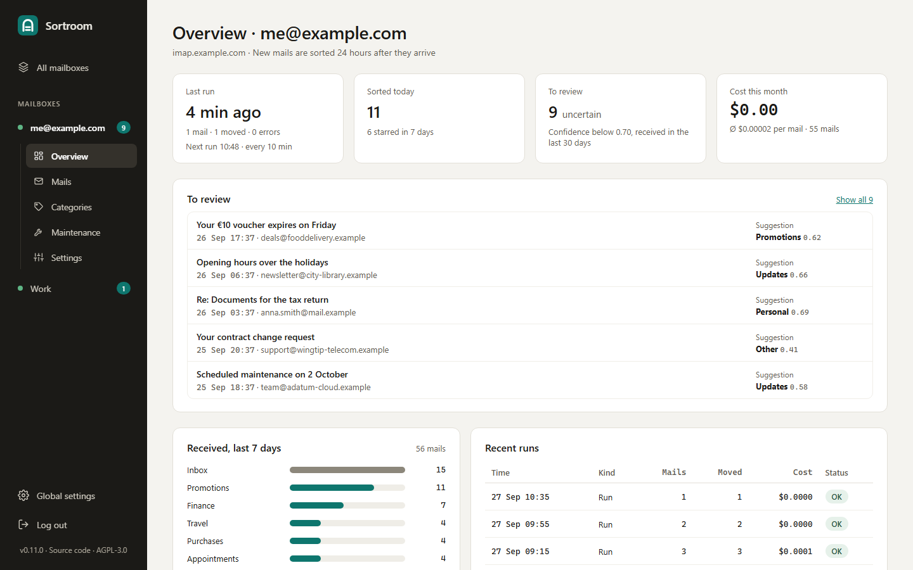
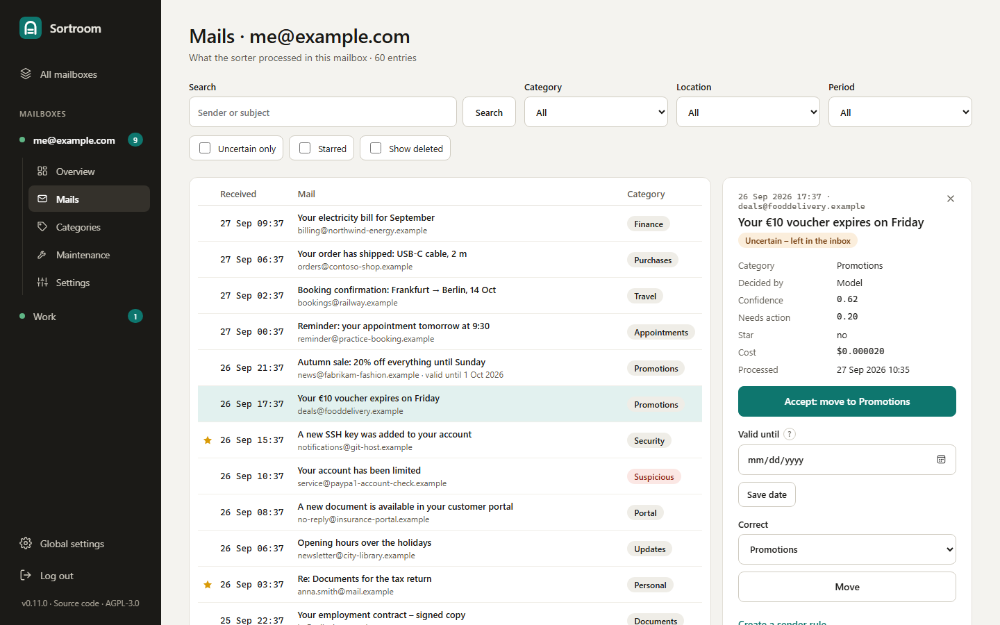
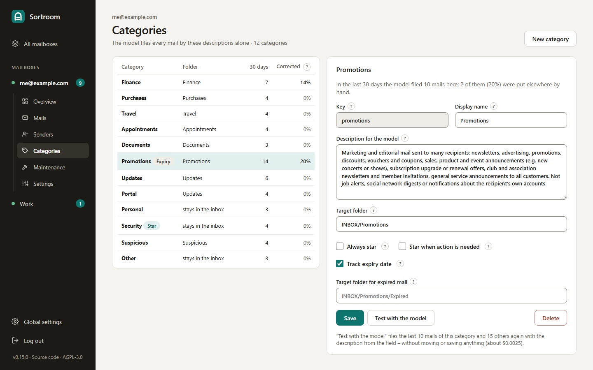

# Sortroom

Sortroom sorts your IMAP inbox into folders. A classification model reads each new mail
and picks one of *your* categories – it doesn't generate text, so it can never invent a
folder. It runs as one Docker container with a web admin UI and works with any IMAP
server (Gmail, Outlook/Microsoft 365, your provider's mailbox, …).

> [!NOTE]
> **Sortroom is in beta.** Before version 1.0, settings, files and the HTTP API can still
> change in ways that need you to do something after an update. Such changes only come
> with a new minor version (e.g. 0.11 → 0.12) and are listed under
> [Upgrading](#upgrading) – read it before you update, or pin a version.



## What it does

- **Sorts new mail** into the folder of its category – finance, purchases, travel,
  promotions, updates … Twelve standard categories come built in (English or German),
  and you can change them freely: the model files by the description you write.
- **Leaves uncertain mail in the inbox** and lists it under *To review*, where you
  accept the suggestion, pick another category or turn the sender into a rule.
- **Stars what needs action** – bills to pay, appointments to confirm, security alerts.
- **Tracks time-limited offers** and moves promotions to an *Expired* folder the day
  after their deadline, so they can be deleted in one go.
- **Sender rules** file known senders without asking the model (free).
- **Several mailboxes**, each with its own categories, schedule and log.
- **Runs by itself** every few minutes; mail you read stays read.

The model is reached through the [TypeSafe API](https://docs.typesafe.ai/api): any
service that speaks it works – a hosted one such as OpenRouter's decisions API (the
default), or a model you host yourself. With the default model on OpenRouter a mail
costs roughly $0.00002.

### Your mail and the model

For each new mail Sortroom sends the model the sender, recipient, subject, attachment
names, whether it is a mailing list and up to 3000 characters of the cleaned text.
**With a hosted endpoint this data goes to that provider** and whoever runs the model
behind it – check their privacy terms. With a self-hosted endpoint it stays in your
network. Apart from that Sortroom only talks to your IMAP server; it sends nothing
anywhere else. Details: [PRIVACY.md](PRIVACY.md).

## What you need

- A machine that runs Docker (amd64 or arm64, e.g. a home server, NAS or Raspberry Pi).
- Access to each mailbox:
  - **Microsoft** (Outlook.com, Hotmail, Microsoft 365) no longer accepts passwords for
    IMAP: you sign in with your account through Sortroom's app – nothing to set up, see
    [Signing in with Google or Microsoft](#signing-in-with-google-or-microsoft).
  - **Gmail**: the sign-in with your account through your own, free OAuth app (a few
    minutes to create), or an **app password** (needs two-factor authentication).
  - **Any other provider**: the IMAP user and password (an app password where the
    provider asks for one).
- An API key for the classification endpoint, e.g. from
  [OpenRouter](https://openrouter.ai/settings/keys) – or your own TypeSafe-API server.

## Quick start (Docker)

1. Create a folder with the three files Sortroom needs on the host:

   ```sh
   mkdir -p sortroom/config sortroom/logs sortroom/mailboxes && cd sortroom
   curl -fsSLO https://raw.githubusercontent.com/mhoenes/sortroom/main/docker-compose.yml
   curl -fsSL -o .env https://raw.githubusercontent.com/mhoenes/sortroom/main/.env.example
   curl -fsSL -o config/config.toml https://raw.githubusercontent.com/mhoenes/sortroom/main/config/config.toml
   sudo chown -R 1000:1000 config logs mailboxes
   ```

   The container runs as uid 1000 and must be able to write `config/`, `logs/` and `mailboxes/`.
2. In `.env` set `ADMIN_PASSWORD` (at least 8 characters). In `docker-compose.yml`
   set `TZ` to your time zone – expiry dates and "today" follow it.
3. Start it:

   ```sh
   docker compose up -d
   ```

4. Open `http://<docker-host>:8765` and log in with `ADMIN_PASSWORD`.
5. Under **Global settings** enter the API key and press **Save & check** – it sends the
   model one sample mail and shows the answer.
6. Under **Add mailbox** choose the type – Gmail, Outlook.com / Microsoft 365 or another IMAP
   server; Gmail and Outlook fill in the server and use the sign-in with your account
   (see [below](#signing-in-with-google-or-microsoft)), otherwise enter server, user and
   password. Pick the standard categories (or copy those of another mailbox). In the new
   mailbox's **Settings**, **Save & check** logs in and lists which target folders exist.

That's it: the mailbox is sorted every 10 minutes from now on. New mail waits 24 hours
in the inbox first, so you still see it there – see [Schedule](#schedule).

**Try it without moving anything first:** under **Maintenance** → *Start a run now*,
**Dry run** classifies the new mail and writes what it *would* do to
`mailboxes/<id>/reports/dry-run-*.csv`. Or switch the schedule off under Settings until
you are happy with the categories.

### Keep the admin UI private

The UI speaks plain HTTP on port 8765 of every network interface of the host. Use it in
your home network or over a VPN, or put it behind a reverse proxy with HTTPS and set
`UI_SECURE_COOKIES=1` in `.env`. To publish it on the host itself only, change the port
line in `docker-compose.yml` to `"127.0.0.1:8765:8765"`. `UI_PORT` in `.env` picks
another port. Logins last 7 days; failed logins are slowed down.

### Updating

```sh
docker compose pull && docker compose up -d
```

`docker-compose.yml` uses `ghcr.io/mhoenes/sortroom:latest`. To pin a version, set
`SORTROOM_IMAGE=ghcr.io/mhoenes/sortroom:0.11` (or `:0.11.0`) in `.env`. Read
[Upgrading](#upgrading) before a new minor version.

### Backup

Back up the whole folder, above all `config/` and `mailboxes/`: they hold the settings,
the logins and API key (`secrets.toml`, see below) and each mailbox's log `state.db`.
`logs/` is optional.

## The admin UI

- **All mailboxes** – every mailbox with its status, today's count, mail to review and
  this month's cost.
- **Overview** (per mailbox) – last and next run, mail to review, received mail of the
  last 7 days by folder, recent runs.
- **Mails** – everything Sortroom processed, with search and filters (category, folder,
  period, uncertain, starred, deleted). The detail panel accepts the model's suggestion,
  moves a mail to another category, sets an offer's expiry date or creates a sender rule.

  

- **Categories** – name, description for the model, target folder, star and expiry
  switches, a folder for expired offers; add or delete categories. **Test with the model**
  classifies the category's last 10 mails and 15 others with the draft description –
  nothing is moved or saved – and shows what would change.

  

- **Maintenance** – runs by hand and repairs, each as a background job with its own log:
  run now, backfill older mail, re-sort a folder, move a category into its new folder,
  rename a folder or a category key, recheck expiry dates, reconcile the log with the
  mailbox. Every task has a **Dry run** that changes nothing. Jobs are listed until the
  container restarts.
- **Settings** – name, IMAP server and login, thresholds, waiting time, schedule and the
  sender rules. At its end, **Delete mailbox** removes the mailbox from Sortroom for good
  (settings, login, log, reports; nothing on the IMAP server) and revokes a Google sign-in.
- **Global settings** (bottom of the sidebar) – UI language (English or German), the
  endpoint and model, the API key.

Settings are written to the mailbox's `mailbox.toml` (comments are kept), checked like
the sorter loads them, and the previous version is kept as `mailbox.toml.bak`. They apply
from the next run, without a restart. A file the container can't write is shown
read-only.

## Logins and the API key

They are set in the UI and stored in plain text, readable only by the container user
(mode `0600`). The fields are write-only: a stored password or key is never shown
again; leave the field empty to keep it.

- `mailboxes/<id>/secrets.toml` – the mailbox's IMAP user and password, or with an OAuth
  sign-in the client secret and the token of the sign-in (no password)
- `config/secrets.toml` – the API key of the classification endpoint

They are read at the start of every run, so a change needs no restart. They are not
copied as `.bak` and are excluded from git and the Docker build – **include them in your
backup**. `.env` holds only `ADMIN_PASSWORD`, `API_TOKEN` and the Docker settings.

## Signing in with Google or Microsoft

Microsoft accepts only OAuth for IMAP, and for Gmail it is the alternative to an app
password. A mailbox gets the sign-in method *Google (OAuth)* or *Microsoft (OAuth)* – on
**Add mailbox** by choosing the type Gmail or Outlook.com / Microsoft 365, later under
Settings → Login.

- **Microsoft:** Sortroom brings its own app, so there is nothing to register: leave the
  client ID empty. On the first sign-in Microsoft asks you to allow Sortroom access to
  your mail.
- **Google:** you create your own OAuth app, once, for free (see below). A shared app is
  not possible: Gmail's scope is restricted, and Google only allows that for a shared app
  after a security assessment.

**The sign-in.** **Save & sign in** opens the provider's sign-in in a new tab. Sign in
with the mailbox's account and allow the access. The provider then sends the browser to
an address starting with `http://localhost` – when the admin UI runs on another computer
(the usual case), that page doesn't load. That's expected: copy the whole address from
the address bar into the field Sortroom shows, and the sign-in is done. If you use the UI
on the Docker host itself (`http://localhost:8765`), it finishes by itself. Sortroom
keeps only the token of the sign-in; you need to sign in again after changing the
method, the client ID or the tenant, or when you revoke the access in your account.

### Google

1. In the [Google Cloud console](https://console.cloud.google.com/) create a project, e.g.
   "Sortroom", and enable the **Gmail API** for it.
2. Under **Google Auth Platform** set up the consent screen: an app name, your address as
   support and developer contact, audience **External**. Under **Data access** add the
   scope `https://mail.google.com/`.
3. Under **Audience** press **Publish app** (status *In production*). This is important:
   while an app is in *Testing*, Google ends its sign-ins after 7 days. A published app
   doesn't need Google's verification for your own use; the sign-in just shows a
   warning that the app isn't verified – continue via **Advanced**. Don't submit the app
   for verification, and leave the links under **Branding** (home page, privacy policy,
   terms) empty: Google only accepts them on a domain you have proven to own.
   What Sortroom does with your data is described in [PRIVACY.md](PRIVACY.md).
4. Under **Clients** create a client of type **Desktop app** and copy its **client ID**
   and **client secret** into the mailbox's settings.

### Microsoft: your own app (optional)

Only needed if your organization allows only its own apps. Registering an app needs a
Microsoft Entra tenant: a work account has one; a personal Outlook.com account gets one
only with an Azure account.

1. In the [Microsoft Entra admin center](https://entra.microsoft.com/) open
   **App registrations → New registration**: a name, e.g. "Sortroom", and the account
   types – usually *Accounts in this organizational directory only*.
2. Under **Authentication** add the platform **Mobile and desktop applications** with the
   redirect URI `http://localhost/oauth/callback` – not one of the suggested URIs. If the
   portal only offers the suggestions, open **Manifest** instead and enter it there:
   `"publicClient": { "redirectUris": ["http://localhost/oauth/callback"] }`.
3. Under **API permissions** add the delegated permissions `offline_access` and
   `IMAP.AccessAsUser.All` (Microsoft Graph). Sortroom asks for them at the sign-in anyway;
   listed here, an administrator can grant them for a whole organization.
4. Copy the **Application (client) ID** into the mailbox's settings. There is no client
   secret. **Tenant**: your organization's tenant ID for an app of one organization;
   empty (`common`) for one that allows personal and work accounts; `consumers` for
   personal accounts only.

In a Microsoft 365 organization, IMAP must also be allowed for the mailbox, and the
organization may require an administrator to approve the app – Sortroom's as well as
your own.

## Schedule

Every mailbox has two schedules under **Settings → Schedule** (`[schedule]` in its
`mailbox.toml`):

```toml
[schedule]
enabled = true            # sort automatically …
interval_minutes = 10     # … every 10 minutes
reconcile_enabled = true  # reconcile the log with the mailbox …
reconcile_hours = 24      # … once a day
```

- **Sort automatically** looks at the inbox's new mail. The first run comes a minute
  after the container starts. A run that finds the mailbox busy (a run or job started by
  hand) is skipped and comes again at the next slot.
- **Reconcile automatically** compares the log with the mailbox: mails you deleted leave
  *To review*, mails you filed by hand get their folder. It only reads the mailbox, waits
  for a run in progress and runs independently of sorting. A reconcile started by hand
  counts too.

The overview shows when the next run is due. `SORTROOM_SCHEDULER=off` in the environment
switches both off for the whole process, e.g. for a second container that should only
serve the UI.

## How it decides

1. It looks at mail in the inbox from the last `lookback_days` (7) that isn't in the
   mailbox's log yet and arrived at least `min_age_hours` ago (24 with the standard
   categories; 0 sorts at once). With **Sort read mails at once**, mail you already read
   doesn't wait.
2. It asks the model, in one request, which category fits and whether the mail needs
   action from you – for categories with expiry tracking also whether it is a
   time-limited offer and when it ends.
3. Confidence ≥ `min_confidence` (0.70) → the mail moves to the category's folder.
   Below that it stays in the inbox and shows up under *To review*.
4. "Needs action" ≥ 0.80 in a category with **Star when action is needed**, or a category
   with **Always star** → the mail is starred (flagged).
5. Mail is read with `BODY.PEEK`: unread mail stays unread.

Target folders are created on the first live run (`INBOX/Finance` becomes `INBOX.Finance`
on servers that use `.` as separator). Gmail has no folders below the inbox, so for
`imap.gmail.com` the standard folders are top-level labels (`Promotions`, not
`INBOX/Promotions`).

`max_per_run` (200) caps the model requests per run, which limits the cost if a lot of
mail arrives at once.

## Standard categories

**Add mailbox** offers the same twelve categories in English and German
(`email_sorter/example_mailbox.en.toml`, `example_mailbox.de.toml`); only keys and
folders differ. The English names follow Gmail's tabs where they overlap. The
descriptions the model reads are English in both.

| Key (en / de) | Folder (en / de) | Notes |
|---|---|---|
| finance / finanzen | INBOX/Finance / INBOX/Finanzen | routine bills, receipts, statements |
| purchases / bestellungen | INBOX/Purchases / INBOX/Bestellungen | |
| travel / reisen | INBOX/Travel / INBOX/Reisen | travel only |
| appointments / termine | INBOX/Appointments / INBOX/Termine | booked events and appointments |
| documents / unterlagen | INBOX/Documents / INBOX/Unterlagen | to keep for years: contracts, official letters, tax certificates |
| promotions / werbung | INBOX/Promotions / INBOX/Werbung | expiry tracking; expired offers → …/Expired, …/Abgelaufen |
| updates / benachrichtigungen | INBOX/Updates / INBOX/Benachrichtigungen | |
| portal | – (inbox) | "new document in your customer portal" notices |
| personal / persoenlich | – (inbox) | |
| security / sicherheit | – (inbox) | always starred |
| suspicious / verdaechtig | INBOX/Suspicious / INBOX/Verdächtig | phishing and scams, never starred |
| other / sonstiges | – (inbox) | |

Add, rename or remove categories freely. The description is all the model knows about a
category, so write it like you would explain the folder to a person – and use **Test
with the model** to see the effect before you save.

## Sender rules

Sender rules are checked before the model, in order; the first whose text is part of
the sender address (case-insensitive) decides. **Leave in the inbox** keeps the mail
untouched, a category moves it to that category's folder – without a model request, so
without cost, star or expiry date. Create them under Settings or from a mail on the
Mails page. In `mailbox.toml`:

```toml
[[sender_rules]]
match = "scanner@example.com"   # scan-to-mail: always stays in the inbox
action = "inbox"

[[sender_rules]]
match = "@newsletter.example"
action = "promotions"           # any category key
```

## Expired offers

For categories with **Track expiry date** (Promotions), the model also answers whether
the mail is a time-limited offer and roughly when it ends (same day, 1–2 days, a week, a
month). An explicit deadline in the text ("valid until 30 September", "gültig bis
30.09.") takes precedence. Every live run moves mails whose last valid day has passed to
the category's expired folder (`INBOX/Promotions/Expired`). Without such a folder the
dates are only recorded. You can set or clear an offer's date on the Mails page.

## Maintenance tasks

All of these are on the **Maintenance** page, run in the background under the mailbox's
lock and have a dry run. On the command line see [Command line](#command-line).

- **Backfill** – normal runs only look at the last `lookback_days`. A backfill sorts older
  mail, month by month, newest first, in batches of `max_per_run`; it can be stopped and
  continues where it left off. Expired offers go straight to the expired folder.
- **Re-sort a folder** – after changing categories, sorts one folder again. Only mail the
  model confidently assigns to a category with a *different* folder is moved.
- **Move a category into its folder** – after changing a category's target folder, moves
  its already sorted mail there, according to the log.
- **Rename a folder** – on the server (with subfolders and subscriptions), in the log and
  in the settings. **Rename a category key** – in the settings and the log.
- **Recheck expiry dates** – finds deadlines for offers sorted before expiry tracking was
  switched on.
- **Reconcile the log with the mailbox** – marks mails you deleted as "no longer in the
  mailbox" and notes mails you filed by hand. Trash, spam, sent and drafts don't count.
  Also runs by itself, see [Schedule](#schedule).

## Several mailboxes

Each mailbox lives in its own folder with its own settings, login, log and reports:

```
config/config.toml        # shared: endpoint and model ([classifier]), UI language
config/secrets.toml       # the API key
mailboxes/
  me-example-com/
    mailbox.toml          # name, [imap], [rules], [schedule], [[sender_rules]], [categories.*]
    secrets.toml          # the IMAP login (password or OAuth token)
    data/state.db         # the log of processed mail and runs
    reports/              # dry-run CSV reports
  work/
    …
```

The folder name is the mailbox's id (for `--mailbox`, the API and the UI addresses) and
follows its display name: "me@example.com" lives in `mailboxes/me-example-com/`, "Büro"
in `mailboxes/buero/`. Renaming a mailbox under Settings moves its folder too – refused
while a run or job is active – so scripts that use the old id need the new one.

**Don't run two installations on the same mailbox** (e.g. the container and a local
copy): each has its own log and they would not know about each other's work.

## Command line

The container also has a command line; on the host prefix the commands with
`docker compose exec sortroom`:

```sh
python -m email_sorter --check                   # log in, list target folders, send the model a sample mail
python -m email_sorter                           # dry run: classify, write a CSV report, change nothing
python -m email_sorter --live                    # sort for real
python -m email_sorter --since 2026-01-01 --live # backfill older mail
python -m email_sorter --resort-folder INBOX/Travel --live
python -m email_sorter --relocate promotions --live
python -m email_sorter --rename-folder INBOX/Newsletter INBOX/Promotions --live
python -m email_sorter --rename-category newsletter promotions --live
python -m email_sorter --recheck-expiry --live
python -m email_sorter --reconcile --live
python -m email_sorter --delete-mailbox <id>          # asks first; --yes for scripts
```

Without `--live` every command is a dry run. Normal runs and `--check` cover every
mailbox; `--mailbox <id>` limits to one, and the maintenance commands need it when there
are several. `--limit N` classifies at most N mails, `-v` logs every decision,
`--config` uses another shared config. Exit codes: `0` ok, `1` a run failed or some mails
failed (tried again next run), `2` a configuration problem, a login or key that is not
set, or an API-key/credit problem.

Dry-run reports (`mailboxes/<id>/reports/dry-run-*.csv`) are UTF-8 with `;` as separator,
so Excel opens them directly also where the decimal separator is a comma. A dry run
doesn't mark mail as processed, so each one classifies the same mail again (a fraction
of a cent) – handy to compare after changing a description.

## HTTP API

To trigger runs from outside (cron, home automation, n8n …), set `API_TOKEN` (at least
16 characters) in `.env`. Every endpoint except `/health` needs
`Authorization: Bearer <API_TOKEN>`. Runs share the mailbox lock: while one runs, `/run`
answers 409.

| Endpoint | What |
|---|---|
| `POST /run` `{"live": true}` | a normal run of every mailbox (or `"mailbox": "<id>"`), returns a summary per mailbox |
| `POST /backfill` `{"since": "2026-01-01", "live": false}` | a backfill in the background, returns a job (202); needs `"mailbox"` when there are several |
| `GET /jobs/{id}` | status and summary of a backfill job |
| `POST /recheck-expiry` `{"live": true}` | find expiry dates of already sorted offers |
| `GET /mailboxes` | the configured mailboxes |
| `DELETE /mailboxes/{id}` | delete a mailbox for good (409 while something runs for it) |
| `GET /health` | liveness, no auth |

## Files

| Path | What |
|---|---|
| `config/config.toml` | shared settings: endpoint, model, UI language |
| `config/secrets.toml` | the API key (mode 0600) |
| `mailboxes/<id>/mailbox.toml` | a mailbox's settings; `.bak` is the previous version |
| `mailboxes/<id>/secrets.toml` | the mailbox's IMAP login: password, or OAuth client secret and token (mode 0600) |
| `mailboxes/<id>/data/state.db` | SQLite log of every processed mail and run (runs are kept 180 days) |
| `mailboxes/<id>/reports/dry-run-*.csv` | dry-run results incl. the runner-up category |
| `logs/sortroom.log` | the application log (rotating, 5 × 1 MB) |

## Troubleshooting

- **Where are the logs?** Every job started in the UI has its log on its page. Scheduled
  runs log to `logs/sortroom.log` and to `docker compose logs -f sortroom`; the overview's
  *Recent runs* shows their result.
- **"not set: IMAP password (mailbox settings) …"** – the login or the API key is missing;
  enter it under Settings or Global settings.
- **The IMAP check fails** – check server, port (993) and login. Gmail and accounts with
  two-factor authentication need an app password or the OAuth sign-in; Microsoft only
  accepts the OAuth sign-in.
- **"The sign-in with Google has expired or was revoked"** – sign in again under the
  mailbox's Settings. If it happens every week, the Google app is still in *Testing*:
  publish it (see [Google](#google)).
- **The sign-in shows an error from Microsoft (AADSTS…)** – with your own app usually the redirect URI
  (`http://localhost/oauth/callback`, platform *Mobile and desktop applications*), the account types of the
  app or the tenant don't fit the account. In an organization it may say that an
  administrator has to approve the app first.
- **The model check fails with HTTP 401, 402 or 403** – the API key is wrong, or the
  provider account has no credit left.
- **Mail stays in the inbox** – it is younger than the waiting time, the model was
  uncertain (see *To review*), or its category has no target folder.
- **Nothing is sorted at all** – check the status under Settings → Schedule and that
  `SORTROOM_SCHEDULER` isn't `off`.

## Development

Sortroom is Python 3.13 with FastAPI and Jinja templates; the log is SQLite.

```sh
python -m venv .venv
.venv/bin/pip install -r requirements-dev.txt        # Windows: .venv\Scripts\pip
cp .env.example .env                                 # set ADMIN_PASSWORD
.venv/bin/python -m uvicorn email_sorter.api:app --port 8765
.venv/bin/python -m pytest
```

Locally the files live in the repository folder (`config/`, `mailboxes/`, `logs/`).

**Docker image.** GitHub Actions (`.github/workflows/docker.yml`) runs the tests on every
push and publishes the image to the GitHub Container Registry for amd64 and arm64:
`:latest` for `main`, `:0.11.0` and `:0.11` for a tag `v0.11.0`, `:sha-<commit>` for
every published commit. In a fork it publishes to `ghcr.io/<you>/sortroom`; a new package
is private until you make it public. To build locally: `docker build -t sortroom .` and
`SORTROOM_IMAGE=sortroom` in `.env`.

**Translations.** UI texts are English in the templates (`{{ _('…') }}`) and the Python
code (`_("…")` from `email_sorter/i18n.py`). Each further language has a catalog
`email_sorter/locale/<code>.json` that maps the English text to its translation
(`[singular, plural]` for `ngettext`). `python tools/i18n_check.py` lists missing texts;
the tests fail on one. A new language needs a catalog, an entry in `i18n.LANGUAGES` and,
if wanted, its own `example_mailbox.<code>.toml`.

**The model's wire format** is the TypeSafe API; if it changes, only `build_request()`
and `parse_response()` in `email_sorter/classifier.py` need updating. The cost per mail is
shown when the provider reports it in `usage.cost` (OpenRouter does), otherwise it stays 0.

## Upgrading

Sortroom is in beta: a new minor version can change settings, files or the HTTP API in a
way that needs action. Every such change is listed here, newest first. Patch versions
(e.g. 0.11.0 → 0.11.1) need nothing.

**From 0.9.x:** logins and the API key are no longer read from `.env`. After the update
enter the API key under Global settings and each mailbox's user and password under its
Settings, then delete `IMAP_*` and `CLASSIFIER_API_KEY` from `.env`. Until then runs
stop with "not set: …".

## License

Copyright (C) 2026 Matthias Hönes

Sortroom is free software: you can redistribute it and/or modify it under the
terms of the GNU Affero General Public License as published by the Free
Software Foundation, either version 3 of the License, or (at your option) any
later version. It is distributed in the hope that it will be useful, but
WITHOUT ANY WARRANTY; without even the implied warranty of MERCHANTABILITY or
FITNESS FOR A PARTICULAR PURPOSE. See [LICENSE](LICENSE) for the full text.

Because the admin UI is a network service, the AGPL asks anyone who runs a
**modified** version for other people to offer those users its source code.
The sidebar links to this repository; if you change Sortroom and let others use
your instance, set `SOURCE_URL` in `.env` to your own source.
